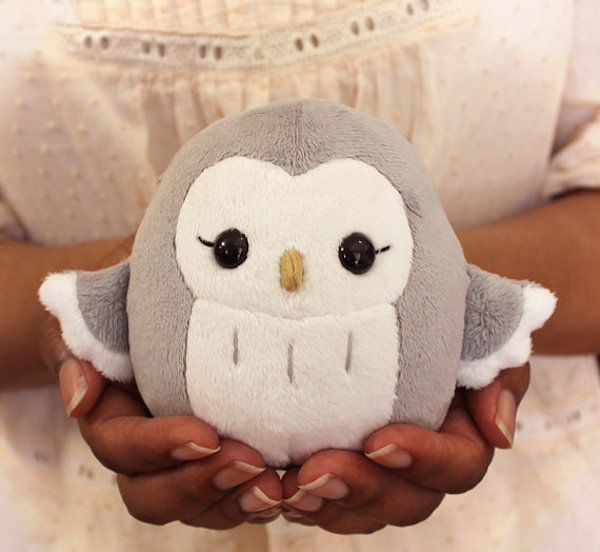
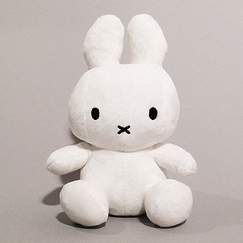

# Product_card
## Date:9/7/2025
## Objective:

To replicate a product card layout similar to those found on real-time e-commerce platform like FlipKart using the CSS Box Model (margin, border, padding, and content).

## Tasks:

#### 1. Structure the HTML Layout:
Create a container ```<div>``` for the product card.

Add an `````` for the product image.

Include ```<h2>``` for product name, ```<p>``` for description, and a ```<span>``` or ```<div>``` for price.

Add a “Buy Now” or “Add to Cart” button.

#### 2. Apply Box Model Styling in CSS:
Use padding inside each section (image, text, button) to ensure readability.

Use margin around the card to space it from the page edges or other cards.

Add a border to outline the card.

Control width and height for consistent sizing.

#### 3. Visual Styling:
Add a background color to the card container.

Use box-shadow to simulate depth (card lifting effect).

Add border-radius for rounded corners.

#### 4. Center the Card:
Use display: flex and justify-content: center and align-items: center on the parent container.

#### 5. Bonus Enhancements:
Use a hover effect on the button (e.g., background color change).

Make the card responsive with percentage-based widths or media queries.
## HTML Code:
```
<!DOCTYPE html>
<html lang="en">
    <head>
        <title>Product Card</title>
        <link rel="stylesheet" href="style.css">
    </head>
    <body>
        <h1>Flipkart - Product Card</h1>
        <div class="box-model">
        <div class="container">
            
            <h2>Penguin Plushie</h2>
            <p>A soft and huggable penguin plushie made with premium cotton fabric.Hand made with love and care.</p>
            <span class="price">$20.00</span>
            <br>
            <button>Buy Now</button>
        </div>
        <div class="container">
            
            <h2>Teddy Plushie</h2>
            <p>Classic teddy bear plushie crafted from ultra-soft materials. Designed to offer comfort and warmth.</p>
            <span class="price">$15.00</span>
            <br>
            <button>Buy Now</button>
        </div>
        <div class="container">
            
            <h2>Jellycat Plushie</h2>
            <p>Inspired by popular Jellycat designs, this plushie is super squishy and irresistibly cuddly.</p>
            <span class="price">$25.00</span>
            <br>
            <button>Buy Now</button>
        </div>
        </div>
    </body>
</html>
```
## CSS Code:
```
img {
  width: 150px;
  height: 150px;
  border-radius: 10px;
  margin-bottom: 10px;
}
body{
    background-color: #f5f5f5;
}
h1{
    text-align: center;
}
.box-model {
  display: flex;
  flex-wrap: wrap;
  justify-content: space-around;
  align-items: center;
  margin: 0;
  padding: 20px;
  font-family: Arial, sans-serif;
}

.container {
  width: 280px;
  height: auto;
  border: 2px solid #ccc;
  background-color: lightgrey;
  display: flex;
  flex-direction: column;
  align-items: center;
  text-align: center;
  padding: 20px;
  margin: 20px;
  border-radius: 10px;
  box-shadow: 10px 10px 20px rgba(0, 0, 0, 0.2);
  transition: transform 0.3s ease;
}

.container:hover {
  transform: scale(1.03);
}

h2 {
  font-size: 18px;
  margin: 10px 0;
  color: #333;
}

p {
  font-size: 14px;
  margin: 10px 0;
  color: #444;
}

button {
  width: 100px;
  height: 40px;
  background-color: #4CAF50;
  color: white;
  border: none;
  border-radius: 5px;
  margin-top: auto;
  transition: background-color 0.3s ease;
}

button:hover {
  background-color: #0d5611;
}

.price {
  font-size: 16px;
  color: #333;
  font-weight: bold;
  margin-top: 10px;
}
```
## Output:


## Result:
A product card layout similar to those found on real-time e-commerce platform like FlipKart using the CSS Box Model is replicated successfully.
